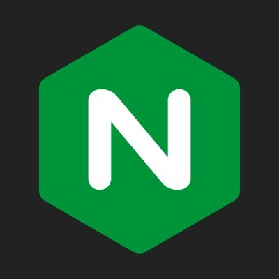
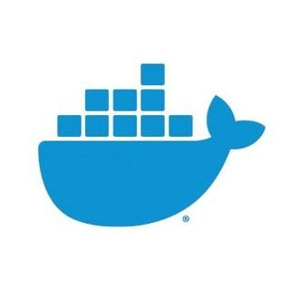
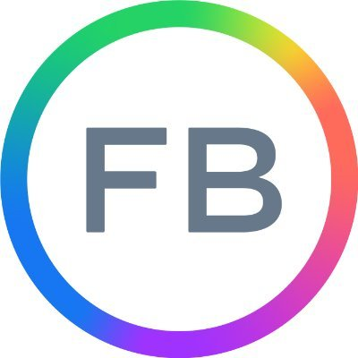

<h1 align="left">Hi there 👋</h1>
<h3 align="left">I am a Software Engineer, developing various web applications.</h3>
<ul>
    <li>🔭 I’m currently working on <b>MEAN Stack</b></li>
    <li>🌱 I’m currently learning <b>Go</b></li>
    <li>📫 How to reach me: <a href="#contact"><b>Here</b></a></li>
</ul>
<h2 id="tools">Languages and Tools</h2>
<table>
  <tr>
    <td>
        </img>
    </td>
    <td>
        </img>
    </td>
    <td>
        </img>
    </td>
    <td>
        </img>
    </td>
    <td>
        </img>
    </td>
  </tr>
  <tr>
    <td>
        </img>
    </td>
    <td>
        </img>
    </td>
    <td>
        </img>
    </td>
    <td>
        </img>
    </td>
  </tr>
  <tr>
    <td>
        </img>
    </td>
    <td>
        </img>
    </td>
    <td>
        </img>
    </td>
  </tr>
</table>
<h2 id="contact">Get in touch</h2>
<table>
  <tr>
    <!-- <td>
        <a href="#">
            </img>
        </a>
    </td> -->
    <td>
        <a href="https://github.com/mzoengc/">
            </img>
        </a>
    </td>
    <td>
        <a href="https://twitter.com/mzoengc/">
            </img>
        </a>
    </td>
    <td>
        <a href="https://leetcode.com/mzoengc/">
            </img>
        </a>
    </td>
    <td>
        <a href="mailto:mingwai.cheung@pm.me">
            </img>
        </a>
    </td>
    <td>
        <a href="mailto:mingwai.cheung@hotmail.com">
            </img>
        </a>
    </td>
    <td>
        <a href="https://www.facebook.com/people/Mary-Cheung/100078629327204/">
            </img>
        </a>
    </td>
    <td>
        <a href="https://www.instagram.com/mzhkca/">
            </img>
        </a>
    </td>
  </tr>
</table>
<h2 id="projects">Other Projects</h2>

 
  